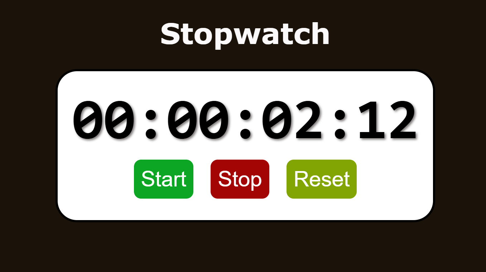

### ⏱️ Stopwatch Program

A simple web-based stopwatch built using HTML, CSS, and JavaScript.
It allows users to start, stop, and reset the timer with an easy-to-use interface.

### 📋 Features

- Start, stop, and reset functionality
- Displays hours, minutes, seconds, and milliseconds
- Clean, responsive UI

### 🧠 Tech Stack

- HTML –> Structure
- CSS –> Styling
- JavaScript –> Stopwatch logic

### 🖼️ Demo
